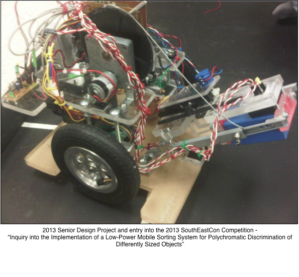

## Description

This contains a sample of one of the PCBs, the lifting mechanism portion, utilized in our 2013 Senior Design Project titled “Inquiry into the Implementation of a Low-Power Mobile Sorting System for Polychromatic Discrimination of Differently Sized Objects” and entered into the 2013 IEEE SouthEastCon. Also shown below is a shot of the final project. This was designed on an extremely limited budget and necessitated the creative repurposing of some common devices and components.

### Lifting mechanism PCB:

### Side view of finished project:

